# Архитектура системы стилей Chotto

## Диаграмма архитектуры

```mermaid
graph TD
    %% Основной файл стилей
    A[style.css] --> B[default/_theme.css]
    A --> C[dark/_theme.css]
    A --> D[green/_theme.css]

    %% Структура default темы
    B --> E[default/variables.css]
    B --> F[default/general.css]
    B --> G[default/components.css]
    B --> H[default/containers.css]
    B --> I[default/layouts.css]
    B --> J[default/messages.css]

    %% Структура dark темы
    C --> K[dark/variables.css]
    C --> L[dark/general.css]
    C --> M[dark/components.css]
    C --> N[dark/containers.css]
    C --> O[dark/layouts.css]
    C --> P[dark/messages.css]

    %% Структура green темы
    D --> Q[green/variables.css]
    D --> R[green/general.css]
    D --> S[green/components.css]
    D --> T[green/containers.css]
    D --> U[green/layouts.css]
    D --> V[green/messages.css]

    %% Базовые цветовые палитры
    E --> W[--emerald-50 до --emerald-950]
    E --> X[--neutral-50 до --neutral-950]
    E --> Y[--p-red-50 до --p-red-950]
    E --> Z[--default-white]

    K --> W
    K --> X
    K --> Y
    K --> Z

    Q --> W
    Q --> X
    Q --> Y
    Q --> Z

    %% Общие настройки
    F --> AA[Шрифты, размеры, цвета]
    L --> BB[Шрифты, размеры, цвета]
    R --> CC[Шрифты, размеры, цвета]

    %% Компоненты
    G --> DD[Chat Panel, SideBar, ChatList]
    G --> EE[Chat Input, Chat Item, Chat Info]
    G --> FF[Scroll Bar, Tooltip, Input]
    G --> GG[Avatar, Template Selector]

    M --> DD
    M --> EE
    M --> FF
    M --> GG

    S --> DD
    S --> EE
    S --> FF
    S --> GG

    %% Сообщения
    J --> HH[Text, Image, Audio, Video]
    J --> II[File, Call, System, Typing]
    J --> JJ[Reply Messages, Link Preview]

    P --> HH
    P --> II
    P --> JJ

    V --> HH
    V --> II
    V --> JJ

    %% Контейнеры и макеты
    H --> KK[Float Container, Modal]
    I --> LL[Base Layout, Extended Layout]
    I --> MM[Feed Layout, Adaptive Layout]

    N --> KK
    O --> LL
    O --> MM

    T --> KK
    U --> LL
    U --> MM

    %% Система переключения
    NN[ThemeMode.vue] --> OO[useTheme.ts]
    OO --> PP[data-theme атрибут]
    PP --> QQ[CSS селекторы]

    %% Применение стилей
    QQ --> RR[Vue компоненты]
    RR --> SS[CSS переменные]
    SS --> TT[Стилизация элементов]

    %% Стили для лучшей визуализации
    style A fill:#e1f5fe,stroke:#01579b,stroke-width:3px
    style B fill:#f3e5f5,stroke:#4a148c,stroke-width:2px
    style C fill:#f3e5f5,stroke:#4a148c,stroke-width:2px
    style D fill:#f3e5f5,stroke:#4a148c,stroke-width:2px
    style W fill:#e8f5e8,stroke:#2e7d32,stroke-width:1px
    style X fill:#f5f5f5,stroke:#424242,stroke-width:1px
    style Y fill:#ffebee,stroke:#c62828,stroke-width:1px
    style Z fill:#ffffff,stroke:#000000,stroke-width:1px
    style NN fill:#fff3e0,stroke:#e65100,stroke-width:2px
    style OO fill:#fff3e0,stroke:#e65100,stroke-width:2px
    style PP fill:#fff3e0,stroke:#e65100,stroke-width:2px
    style QQ fill:#fff3e0,stroke:#e65100,stroke-width:2px
```



## Ключевые особенности архитектуры

### 1. **Модульная структура**
- Каждая тема разделена на логические модули
- Переиспользование базовых цветовых палитр
- Изоляция стилей по функциональности

### 2. **Иерархия CSS переменных**
- Базовые цвета → Общие настройки → Специфичные стили
- Каскадное применение через `data-theme` атрибуты
- Централизованное управление через переменные

### 3. **Система переключения**
- Vue компонент ThemeMode
- Хук useTheme для управления состоянием
- Динамическое применение через data-theme

### 4. **Типы стилей**
- **Variables**: Базовые цветовые палитры
- **General**: Общие настройки (шрифты, размеры)
- **Components**: Стили UI компонентов
- **Messages**: Стили сообщений
- **Containers**: Стили контейнеров
- **Layouts**: Стили макетов

## Структура файлов

```
src/assets/themes/
├── default/
│   ├── _theme.css          # Главный файл темы
│   ├── variables.css       # Базовые цветовые палитры
│   ├── general.css         # Общие настройки
│   ├── components.css      # Стили компонентов
│   ├── containers.css      # Стили контейнеров
│   ├── layouts.css         # Стили макетов
│   └── messages.css        # Стили сообщений
├── dark/
│   ├── _theme.css
│   ├── variables.css
│   ├── general.css
│   ├── components.css
│   ├── containers.css
│   ├── layouts.css
│   └── messages.css
└── green/
    ├── _theme.css
    ├── variables.css
    ├── general.css
    ├── components.css
    ├── containers.css
    ├── layouts.css
    └── messages.css
```

## Цветовые палитры

### Emerald (зеленые оттенки)
- `--emerald-50` до `--emerald-950`
- Используется для акцентных элементов, кнопок, статусов

### Neutral (нейтральные оттенки)
- `--neutral-50` до `--neutral-950`
- Используется для фонов, текста, границ

### Red (красные оттенки)
- `--p-red-50` до `--p-red-950`
- Используется для ошибок, предупреждений, непрочитанных сообщений

### White
- `--default-white: #ffffff`
- Используется для основных фонов

## Система переключения тем

1. **ThemeMode.vue** - компонент селектора тем
2. **useTheme.ts** - хук для управления состоянием темы
3. **data-theme** - атрибут для применения CSS селекторов
4. **CSS селекторы** - `[data-theme="light"]`, `[data-theme="dark"]`, `[data-theme="green"]`

## Принципы работы

### Поток данных
1. Пользователь выбирает тему в ThemeMode
2. useTheme обновляет состояние
3. data-theme атрибут применяется к корневому элементу
4. CSS селекторы активируют соответствующие стили
5. Vue компоненты получают обновленные CSS переменные

### Преимущества архитектуры
- ✅ **Модульность**: Легко добавлять новые темы
- ✅ **Переиспользование**: Общие цветовые палитры
- ✅ **Производительность**: CSS переменные работают быстро
- ✅ **Гибкость**: Можно настраивать отдельные элементы
- ✅ **Поддержка**: Четкая структура файлов

Эта архитектура обеспечивает гибкость, переиспользование кода и легкое добавление новых тем.
