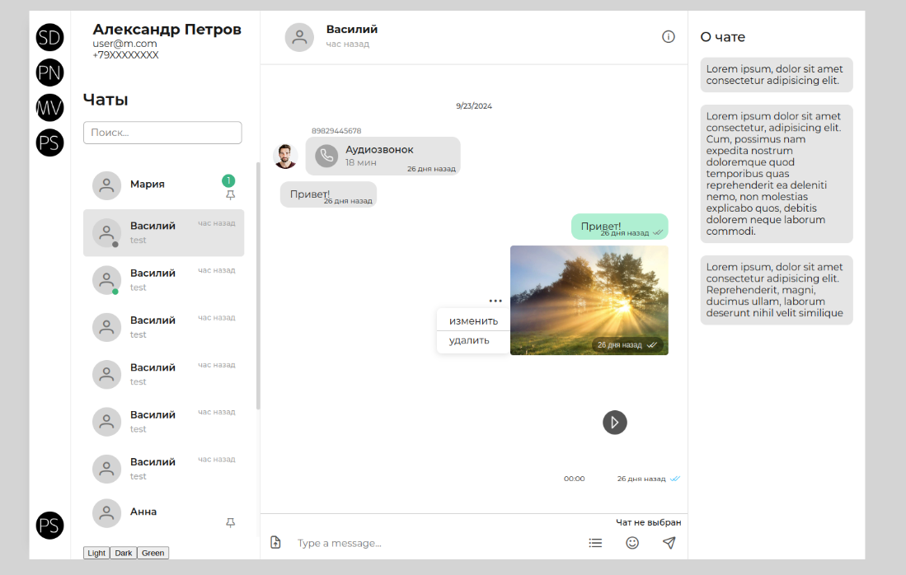

# chotto
Vue3 Chat UI components - собери свой интерфейс чата

# использование

## документация

- [storybook](https://mobilon-dev.github.io/chotto/)

## схема

## пример

[пример](https://github.com/antirek/chotto-sample)

## скриншот

# разработка

## install

> npm i

## run storybook

> npm run storybook

## run dev

> npm run dev

## build

> npm run build

# Дополнительно

### скрины чатов для вдохновения

[samples](/samples)

### подобные проекты

- https://github.com/sendbird/sendbird-uikit-react

- https://github.com/detaysoft/react-chat-elements

- https://github.com/pubnub/react-chat-components

- https://github.com/jakobhoeg/shadcn-chat

- https://github.com/advanced-chat/vue-advanced-chat

- https://github.com/mattmezza/vue-beautiful-chat

- https://github.com/MatheusrdSantos/vue-quick-chat
