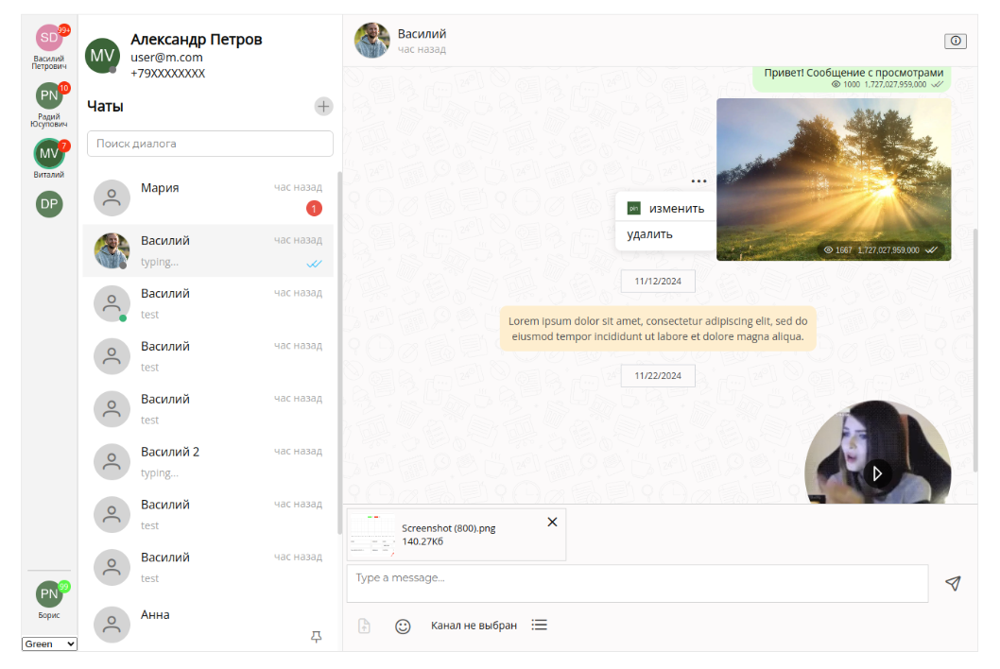

# Chotto UI

🚀 **Vue 3 UI библиотека компонентов для создания современных чат-интерфейсов и AI-ассистентов**

[](https://vuejs.org/)
[](https://www.typescriptlang.org/)
[](LICENSE)

## 📖 Документация и ресурсы

- 📚 **[Документация](https://mobilon-dev.github.io/chotto-docs/)** - Полное руководство по использованию
- 🎨 **[Storybook](https://mobilon-dev.github.io/chotto/)** - Интерактивные примеры 20+ компонентов
- 🎯 **[Демо-приложения](https://mobilon-dev.github.io/chotto-demo/)** - 7 готовых примеров использования
- 💬 **[Telegram чат разработчиков](https://t.me/chottodev)** - Сообщество и поддержка

## 🖼️ Скриншоты



## 🎥 Видео-обзоры

- [Chotto 01: Welcome](https://youtu.be/LbtXeR_P9fs) - Введение в библиотеку
- [Chotto 02: WABA templates](https://youtu.be/bwhcn6KAn28) - Работа с шаблонами WABA

## ✨ Возможности

### 🎨 **Богатый набор компонентов**
- **20+ готовых компонентов** для создания чат-интерфейсов
- **Модульная архитектура** - используйте только нужные компоненты
- **TypeScript поддержка** - полная типизация всех компонентов

### 💬 **Множественные типы сообщений**
- 📝 Текстовые сообщения с поддержкой Markdown
- 🖼️ Изображения с превью и галереей
- 🎵 Аудио сообщения с плеером
- 🎬 Видео сообщения с встроенным плеером
- 📎 Файлы с превью и загрузкой
- 📞 Звонки с транскрипцией
- 💬 Ответы на сообщения
- 📅 Разделители дат
- ⚙️ Системные уведомления
- ⌨️ Индикатор печати

### 🎯 **Продвинутые функции**
- 🔍 **Поиск по сообщениям** с подсветкой результатов
- 📱 **Адаптивные макеты** для всех устройств
- 🎨 **3 готовые темы**: светлая, темная, зеленая
- 🌍 **Многоязычность**: русский и английский
- 🔔 **Система уведомлений** в реальном времени
- 📊 **Просмотры сообщений** с счетчиками
- 🔗 **Предпросмотр ссылок** с метаданными
- 🎵 **Встроенные медиаплееры** (YouTube, Яндекс.Музыка, Rutube, VK)
- ⌨️ **Клавиатуры быстрых ответов**
- 📝 **Шаблоны сообщений** (WABA, групповые)
- 🎤 **Запись аудио и видео**
- 😊 **Поддержка эмодзи**

### 🏗️ **Гибкая архитектура**
- **Layouts** - определяют структуру интерфейса
- **Containers** - высокоуровневые обертки
- **Components** - переиспользуемые UI элементы
- **Messages** - типизированные компоненты сообщений
- **Modals** - диалоговые окна

## 🚀 Быстрый старт

### Установка

```bash
npm install @mobilon-dev/chotto
```

### Базовое использование

```vue
<template>
  <div class="chat-app">
    <BaseContainer height="90vh" width="90vw">
      <ExtendedLayout>
        <!-- Боковая панель -->
        <template #first-col>
          <SideBar :sidebar-items="sidebarItems" />
          <ThemeMode :themes="themes" />
        </template>
        
        <!-- Список чатов -->
        <template #second-col>
          <ChatList 
            :chats="chats" 
            @select="selectChat"
          />
        </template>
        
        <!-- Область чата -->
        <template #third-col>
          <ChatWrapper>
            <ChatInfo :chat="selectedChat" />
            <Feed :objects="messages" />
            <ChatInput @send="sendMessage" />
          </ChatWrapper>
        </template>
      </ExtendedLayout>
    </BaseContainer>
  </div>
</template>

<script setup>
import {
  BaseContainer,
  ExtendedLayout,
  SideBar,
  ChatList,
  ChatWrapper,
  ChatInfo,
  Feed,
  ChatInput,
  ThemeMode
} from '@mobilon-dev/chotto'
import '@mobilon-dev/chotto/themes/index.scss'

// Ваша логика...
</script>
```

## 🛠️ Разработка

### Требования
- Node.js 18+
- npm или yarn

### Установка зависимостей
```bash
npm install
```

### Запуск в режиме разработки
```bash
npm run dev
```

### Запуск Storybook
```bash
npm run storybook
```

### Сборка библиотеки
```bash
npm run build
```

### Проверка кода
```bash
npm run lint
npm run lint-fix
```

## 🏗️ Архитектура

```
src/
├── library/           # Основная библиотека компонентов
│   ├── layouts/      # Макеты (BaseLayout, ExtendedLayout, etc.)
│   ├── components/   # UI компоненты (ChatInput, ChatList, etc.)
│   ├── messages/     # Компоненты сообщений (TextMessage, ImageMessage, etc.)
│   ├── containers/   # Контейнеры (BaseContainer, FloatContainer)
│   └── modals/       # Модальные окна
├── helpers/          # Утилиты и хелперы
├── types/            # TypeScript типы
├── data/             # Mock данные для демонстрации
├── themes/           # Стили и темы (default, dark, green)
└── locale/           # Локализация (EN, RU)
```

Дополнительно в корне:

```
.storybook/           # Storybook конфигурация
docs/                 # Сборка Storybook (output)
scripts/              # Скрипты (валидатор тем)
PUBLISH.md            # Шаги публикации пакета
THEME_ARCHITECTURE_PROMPT.md  # Черновик архитектуры тем
```

## 🎨 Темы и кастомизация

### Доступные темы
- **Default** - светлая тема
- **Dark** - темная тема  
- **Green** - зеленая тема

### Кастомизация CSS переменных
```css
[data-theme="light"] {
  --chotto-primary-color: #10b981;
  --chotto-secondary-color: #6b7280;
  --chotto-background-color: #ffffff;
  /* ... другие переменные */
}
```

## 📱 Адаптивность

Библиотека поддерживает адаптивные макеты:
- **Desktop** - 3-колоночный макет
- **Tablet** - 2-колоночный макет  
- **Mobile** - 1-колоночный макет

## 🌍 Локализация

Поддерживаемые языки:
- 🇷🇺 Русский
- 🇺🇸 Английский

```javascript
import { useLocale } from '@mobilon-dev/chotto'

const { t } = useLocale()
console.log(t('component.ChatInput.InputPlaceholder'))
```

## 📦 Типы сообщений

### Текстовые сообщения
```javascript
{
  type: "message.text",
  text: "Привет!",
  position: "left",
  status: "read",
  time: "14:30",
  avatar: "https://example.com/avatar.jpg"
}
```

### Медиа сообщения
```javascript
{
  type: "message.image",
  url: "https://example.com/image.jpg",
  alt: "Описание изображения",
  position: "right",
  status: "sent"
}
```

## 🔌 Интеграция с бэкендом

### Data Provider
```javascript
const dataProvider = {
  getFeed(chatId) {
    // Загрузка сообщений
    return fetch(`/api/chats/${chatId}/messages`)
  },
  addMessage(message) {
    // Отправка сообщения
    return fetch('/api/messages', {
      method: 'POST',
      body: JSON.stringify(message)
    })
  }
}
```

### Event Provider
```javascript
const eventor = {
  push(event) {
    // Обработка событий в реальном времени
    console.log('New event:', event)
  },
  subscribe(callback) {
    // Подписка на события
  }
}
```

## 🤝 Сообщество

### Полезные ссылки
- [Telegram чат](https://t.me/chottodev) - Обсуждения и поддержка
- [Issues](https://github.com/mobilon-dev/chotto/issues) - Баги и предложения
- [Discussions](https://github.com/mobilon-dev/chotto/discussions) - Общие вопросы

### Похожие проекты
- [Sendbird UIKit](https://github.com/sendbird/sendbird-uikit-react)
- [React Chat Elements](https://github.com/detaysoft/react-chat-elements)
- [Vue Advanced Chat](https://github.com/advanced-chat/vue-advanced-chat)
- [Lobe Chat](https://github.com/lobehub/lobe-chat)

## 📄 Лицензия

MIT License - см. файл [LICENSE](LICENSE) для деталей.

## 🙏 Благодарности

Спасибо всем участникам сообщества за вклад в развитие проекта!

---

**Создавайте потрясающие чат-интерфейсы с Chotto UI! 🚀**


